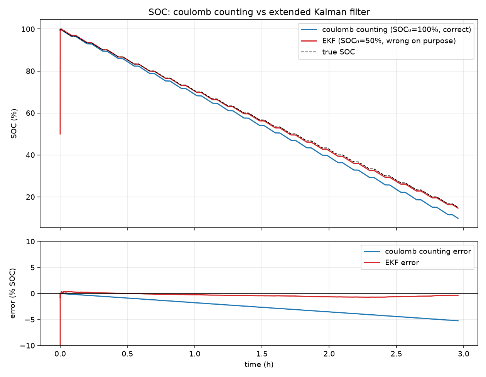

# Battery-SOC-Estimator

State-of-charge estimation for an 18650 cell: **coulomb counting vs an
extended Kalman filter**, with data logged by an INA219 current sensor on an
Arduino Mega.



*On the included synthetic dataset: coulomb counting starts from the
**correct** SOC and still drifts to −5 % error; the EKF starts from a
**deliberately wrong** SOC (50 % vs true 100 %), converges within minutes,
and stays within ±0.6 % for the rest of the discharge.*

## Repository layout

| folder | contents |
|---|---|
| `firmware/` | Arduino Mega sketch: INA219 → timestamped CSV over serial at 1 Hz, plus a serial-capture script |
| `python-coulomb-counting/` | open-loop coulomb-counting estimator + drift discussion |
| `python-kalman/` | OCV-R-RC battery model, EKF, and the comparison script/plot |
| `simulink/` | script-built Simulink twin of the EKF for cross-validation |
| `data/` | synthetic 18650 discharge dataset + its generator |

## Why coulomb counting drifts — and how the Kalman filter fixes it

**Coulomb counting** integrates measured current: `SOC = SOC₀ − (1/Q)∫η·I dt`.
It is open loop. It needs `SOC₀` handed to it, and it accumulates every
systematic measurement error forever:

- a constant current-sensor **offset** (INA219 offset + shunt tolerance)
  integrates into a **linearly growing** SOC error — 30 mA against a
  2500 mAh cell is 1.2 % SOC per hour, unbounded;
- **gain error** (~1–2 % shunt tolerance) mis-counts charge in proportion to
  throughput;
- **capacity uncertainty** (aging, temperature) mis-scales everything;
- and there is **no mechanism to remove any of these errors** once made,
  because the estimator never looks at the cell voltage.

**The Kalman filter** keeps the coulomb integral as its *prediction* step —
so short-term it is exactly as smooth as coulomb counting — but adds an
*update* step: it predicts the terminal voltage from a battery model
(`V = OCV(SOC) − V₁ − R₀·I`) and nudges the SOC estimate in proportion to the
voltage prediction error, weighted by the Kalman gain. The OCV(SOC)
relationship is the anchor: voltage is an absolute (if noisy and lagging)
witness of SOC, so bias-driven drift gets continuously pulled back and a
wrong initial SOC is forgiven within minutes. Errors stay **bounded** instead
of growing. The model is OCV-R-RC (first-order Thevenin) rather than plain
OCV-R — justification in `python-kalman/README.md`.

## Validate the whole pipeline with the synthetic dataset

No hardware needed. `data/synthetic_discharge.csv` (committed) is ~3 h of
pulsed 1 A discharge of a simulated 2500 mAh NMC 18650, corrupted with
realistic INA219 errors — including the +30 mA offset and 2 % gain error that
make coulomb counting drift. It has the exact column layout the firmware
logs (`time_ms,voltage_V,current_mA`) plus a `true_soc` ground-truth column.

```bash
pip install numpy pandas matplotlib

# (optional) regenerate the dataset
python data/generate_synthetic_dataset.py -o data/synthetic_discharge.csv

# 1. coulomb counting alone — watch it drift
cd python-coulomb-counting
python coulomb_counting.py ../data/synthetic_discharge.csv
# -> "final error vs truth: -5.25 % SOC", coulomb_soc.png

# 2. EKF vs coulomb counting on the same log
cd ../python-kalman
python compare_soc.py ../data/synthetic_discharge.csv
# -> EKF final error ~ -0.35 %, soc_comparison.png, ekf_soc.csv

# 3. cross-validate the Simulink twin (requires MATLAB/Simulink)
#    in MATLAB, from simulink/:   run_soc_ekf
```

When you have real data, the same commands work on the firmware's CSV —
you'll just have no `true_soc` column, so the scripts skip the error plots.
Fit `capacity_mah`, `R0`, `R1`, `tau1` and the OCV table to your cell first
(pulse-test procedure in `python-kalman/battery_model.py`).

## What's still needed physically

Things this repo can't do for you, roughly in order:

1. **Safe discharge rig.** Use a protected test setup: an electronic load or
   power resistor sized for the power (1 A from ~3.7 V ≈ 4 W — use a ≥10 W
   resistor on a heatsink), a fuse (2 A fast-blow) in line with the cell, and
   a **hard low-voltage cutoff** — never discharge an 18650 below 2.5 V (stop
   at 3.0 V to be kind to it). Don't rely on the logging script to stop the
   test; use a protected cell or a comparator/relay cutoff, and never leave a
   discharge unattended. Work on a non-flammable surface with a Class D/ABC
   extinguisher or sand nearby; LiPo-safe bag for storage.
2. **Cell holder.** Use a proper 18650 holder with sprung contacts rated for
   your current — don't solder directly to the cell (heat damages the cell
   and can compromise the safety vent). Check polarity twice; a reversed
   cell in a holder is a dead short through your wiring. Keep the wrapper
   intact — a nicked wrapper near the positive shoulder is a short waiting
   to happen.
3. **Wire the INA219** per the table in `firmware/README.md`: shunt (VIN+ →
   VIN−) in the **high side** of the discharge path, cell − / load return /
   Mega GND common. Verify discharge reads *positive* before trusting a log.
4. **Zero-offset calibration.** Log a few minutes at no load and note the
   mean reported current — that's your offset bias. Subtracting it in
   post-processing slows (but never eliminates) coulomb-counting drift, and
   makes for a fairer comparison.
5. **Characterize your actual cell**: rested-OCV points at ~10 SOC levels for
   the OCV table, a pulse test for R0/R1/τ1, and a full slow discharge for
   true capacity. Drop the numbers into `python-kalman/battery_model.py` and
   the parameter block in `simulink/build_soc_ekf_model.m` (they must match).
6. **Temperature** — parameters shift with temperature; log ambient at least,
   and keep test-to-test conditions consistent.

## License

MIT — see [LICENSE](LICENSE).
